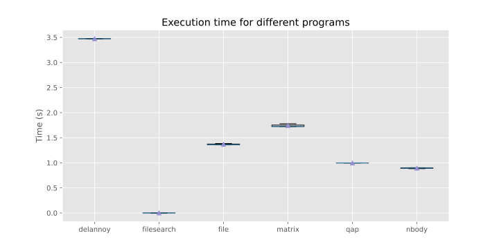
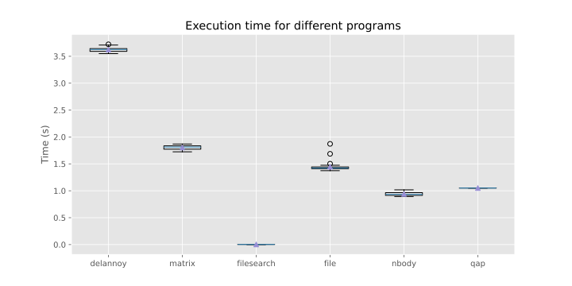
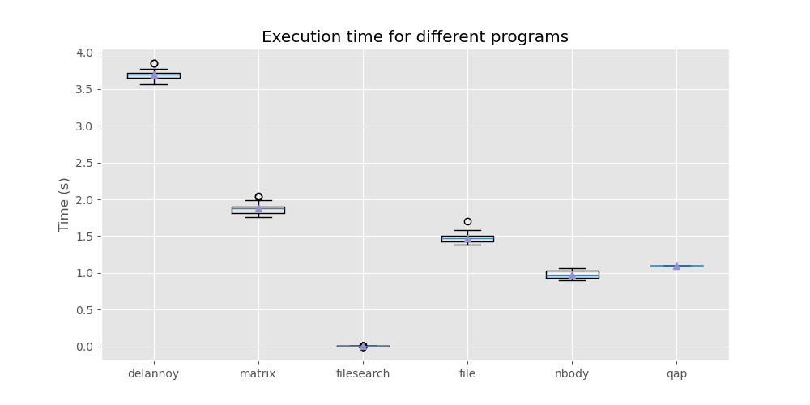

#### Leopold Schmid

# Exercise 2

The execution time of the programs barely increased while running `./tools/load_generator/exec_with_workstation_heavy.sh`. This is probably due to a sufficient number of cores. However, an increased variance between the repeated measurements is observable.

To validate this assumptions the `./tools/load_generator/exec_with_workstation_heavy.sh` script was extended to stress all 20 cores of the cpu.

While the execution time allmost stayed constant, the variance further increased.